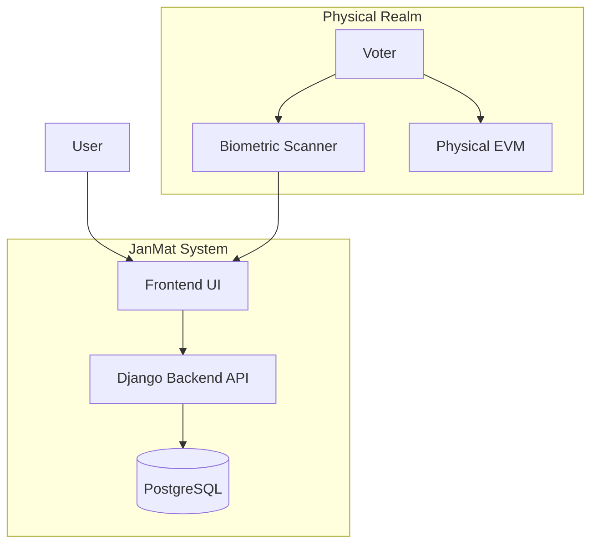

# JanMat Project - Complete Explanation

## 🎯 What is JanMat?
JanMat is a **Secure Biometric E-Voting Booth System**.
**Crucial Distinction**: JanMat DOES NOT cast votes. It ONLY verifies voters before they go to the physical EVM (Electronic Voting Machine).

### The Analogy
- **Airport Security (JanMat)**: Verifies identity.
- **Boarding Plane (EVM)**: The actual action (voting).
- **Security ≠ Flying**: JanMat creates trust, but doesn't record the choice.

---

## 🏗️ System Architecture

### The Big Picture

### 👥 User Roles & Hierarchy
The system enforces a **strict 3-Tier Hierarchy**:

1.  **SUPERUSER (System Admin)**
    -   **Level**: Top
    -   **Creation**: `python manage.py createsuperuser`
    -   **Powers**: Create/Manage ADMINs and OPERATORs. Full System Access.
    -   **Tenant**: Acts as a root tenant.

2.  **ADMIN (Election Commission)**
    -   **Level**: Middle
    -   **Creation**: Created by SUPERUSER.
    -   **Tenant Isolation**: **Critical**. Each Admin is a "Tenant".
    -   **Powers**: Create/Manage OPERATORs. View Stats/Logs for *their* tenant only.
    -   **Restrictions**: Cannot verify voters. Cannot see other Admins' data.

3.  **OPERATOR (Booth Staff)**
    -   **Level**: Bottom
    -   **Creation**: Created by ADMIN (or SUPERUSER).
    -   **Powers**: Verify Voters (Aadhaar + OTP + Biometric).
    -   **Restrictions**: Read-only access to verification flows. No User creation.

---

## 🔐 Tenant Isolation (Critical)
Every piece of data is "owned" by an Admin (Tenant). Use `admin_id` foreign keys everywhere.

**Scenario**:
*   **Delhi Admin** (ID: 1) has Operator A and voters.
*   **Mumbai Admin** (ID: 2) has Operator B and voters.
*   *Result*: Delhi Admin running a query for "All Voters" gets `WHERE admin_id=1`. Mumbai data is invisible.

---

## 🔄 Complete Voter Verification Flow

### 1. Operator Login
*   **Input**: Email/Password.
*   **Check**: Authenticated? Is Operator? Belongs to valid Admin?
*   **Result**: Access Operator Dashboard.

### 2. Aadhaar + OTP
*   **Input**: Voter's Aadhaar Number.
*   **Action**: Backend calls Sandbox API -> Sends OTP to Voter.
*   **Verify**: Operator enters OTP.
*   **Display**: On success, show Photo + Details.
*   **Human Check**: Operator visually matches Photo to Person.

### 3. Biometric Verification (The Core Security Layer)
JanMat uses a **Hash-Based** approach for security.

1.  **Capture**: Scanner reads fingerprint (Raw Data).
2.  **Process**: Extract Template.
3.  **Hash**: `HMAC-SHA256(Template + Secret_Salt)`.
4.  **Lookup**: Check DB for this Hash *under this Admin*.

**Outcomes**:
*   **UNIQUE**: First time. Store Hash. **Status: VERIFIED**. -> **Go to EVM**.
*   **DUPLICATE**: Hash exists. **Status: FRAUD**. -> **Block**.

---

## 🗄️ Database Schema Key Points
-   **Users**: RBAC (Superuser, Admin, Operator).
-   **BiometricTemplates**: Stores `template_hash` (indexed) + `admin_id`.
-   **FraudLogs**: Immutable record of duplicate attempts.

---

## 🐳 Deployment
-   **Docker Compose**: Orchestrates Django, Postgres, Nginx.
-   **Env Switching**: Single codebase, `.env` toggles Local/Prod.
